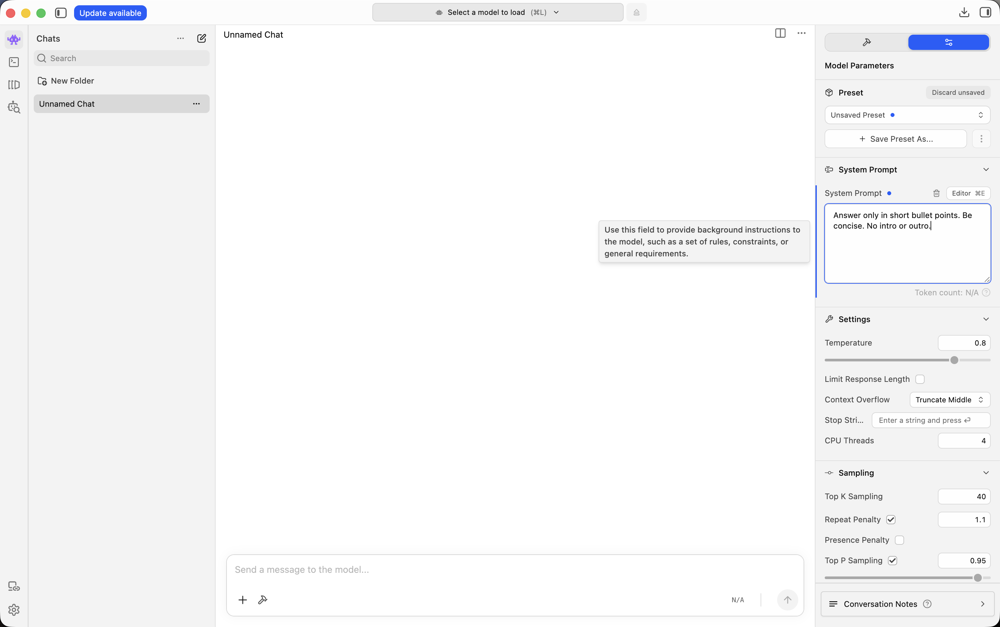
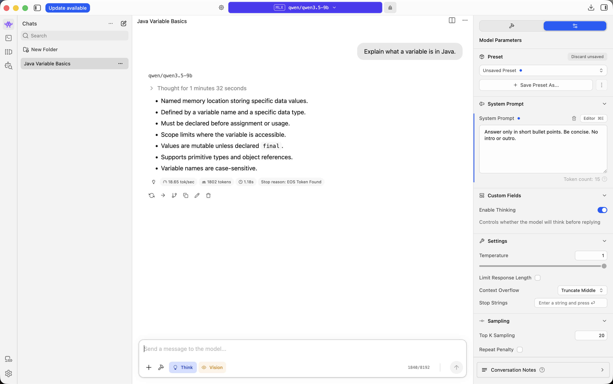

# Preprompting (System Prompt)

## What it is

A preprompt (also called a system prompt) is standing instructions the model sees before your message. Use it for role, tone, rules, or output format.

The user prompt is what you type in the chat box. The system prompt sits “above” that and shapes every reply in the chat.

## Try it in LM Studio

1. Open Chat (`⌘1`) and load Qwen3.5 9B.
2. Start a New chat.
3. On the right sidebar, open the sliders (Model Parameters), not the hammer.
4. Find System Prompt (under Prompt / Prediction). Click Edit System Prompt… or the field to add instructions.



5. Leave System Prompt empty. Send:

```
Explain what a variable is in Java.
```

6. Note the style of the reply (length, tone, structure).
7. Set System Prompt to:

```
Answer only in short bullet points. Be concise. No intro or outro.
```

8. Start a New chat (so the new system prompt applies cleanly), load the same model if needed, and send the same user prompt again.
9. Compare the two replies.



## Takeaway

Same question, different standing rules → different answer shape. Change the system prompt when you want consistent behavior across many messages.
