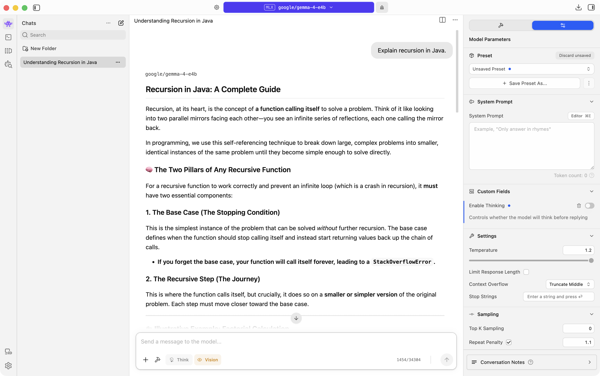
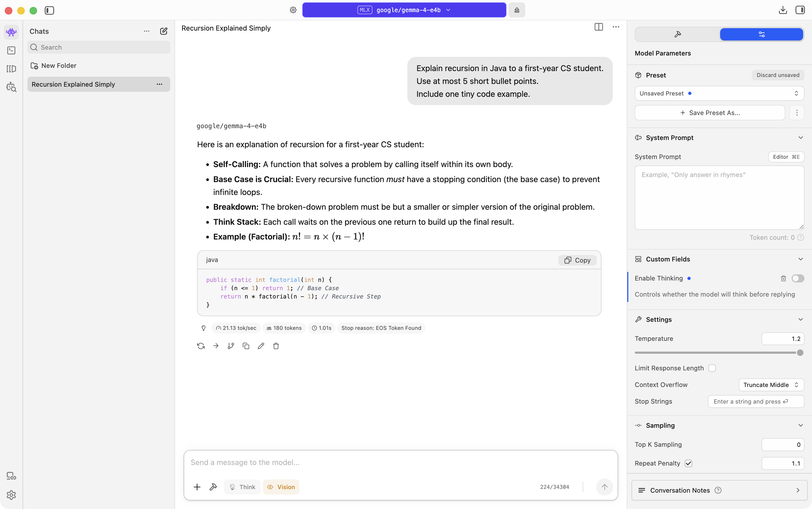
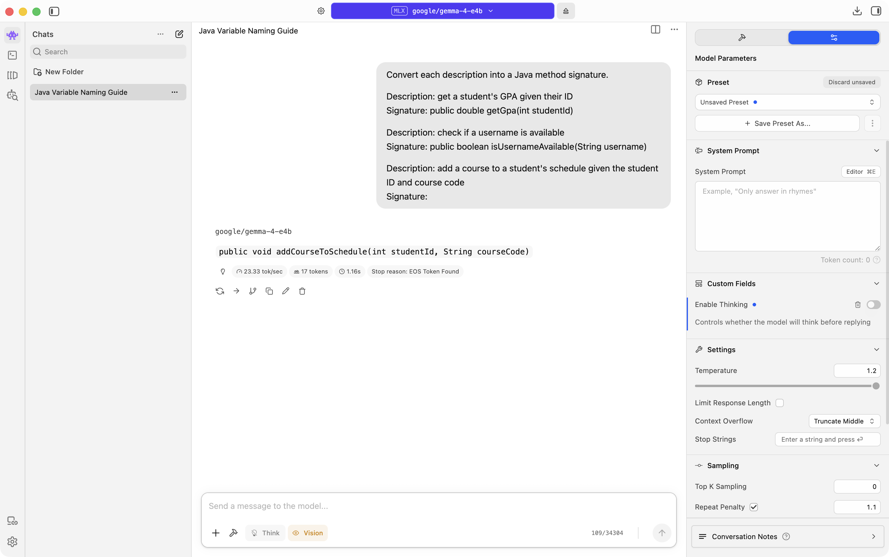

# Prompting Techniques

## What they are

Prompting techniques are patterns for how you ask the model. Same model, same chat settings, different ask → different answer.

This lab focuses on the user prompt (what you type in the chat box). Leave the system prompt empty so the results come from your message only. For standing rules across many chats, see Preprompting.

## Try it in LM Studio

1. Open Chat (`⌘1`) and load Gemma 4 E4B.
2. Clear System Prompt if anything is there.
3. Use a New chat for each technique below so older messages do not affect the reply.

### Zero-shot

Zero-shot means you ask with no examples. Just the question.

Send:

```
Explain recursion in Java.
```

Note the length, tone, and structure of the reply.



### Add constraints

Constraints tell the model who the answer is for, how long it should be, and what format to use.

Start a New chat. Send:

```
Explain recursion in Java to a first-year CS student.
Use at most 5 short bullet points.
Include one tiny code example.
```

Compare this reply to the zero-shot one.



### Few-shot

Few-shot means you give a few input/output examples, then ask for the next one. The model continues the pattern.

Start a New chat. Send:

```
Convert each description into a Java method signature.

Description: get a student's GPA given their ID
Signature: public double getGpa(int studentId)

Description: check if a username is available
Signature: public boolean isUsernameAvailable(String username)

Description: add a course to a student's schedule given the student ID and course code
Signature:
```

The reply should be just a signature, something like `public void addCourse(int studentId, String courseCode)`. That short answer is the technique working: the model saw the pattern and continued it instead of explaining. It picked the return type, the name style, and the parameters from your examples. Compare that to the long zero-shot reply earlier.



### Vague vs specific

Start a New chat. Send:

```
Help with loops
```

Note how open-ended the reply is.

Start another New chat. Send:

```
Write a Java for-loop that prints 1 to 10. Only the code, no explanation.
```

Compare the two. Clear instructions usually get clearer answers.

## Takeaway

Clear instructions, examples, and constraints beat vague prompts. Use the system prompt for standing rules. Use the user prompt for the specific ask in front of you.
