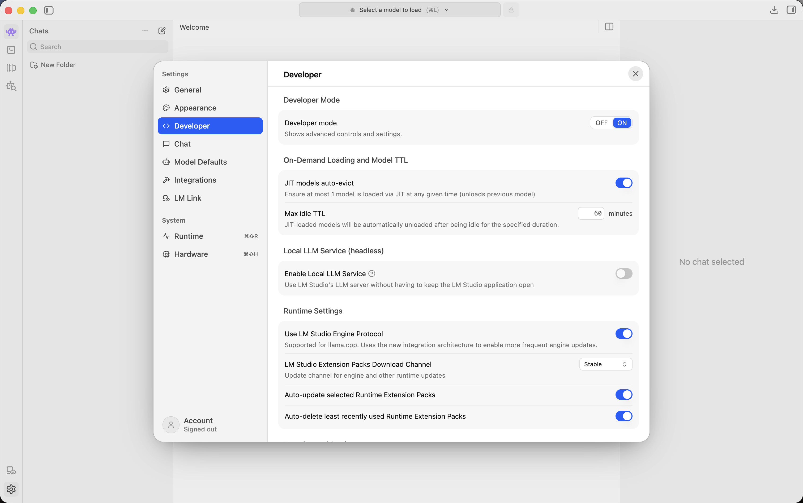
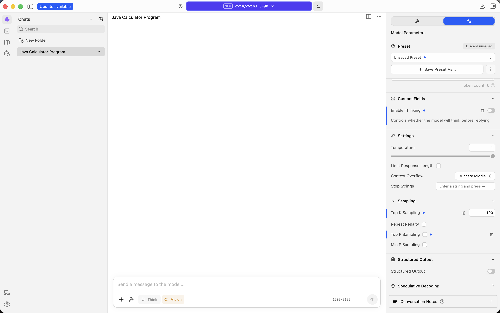
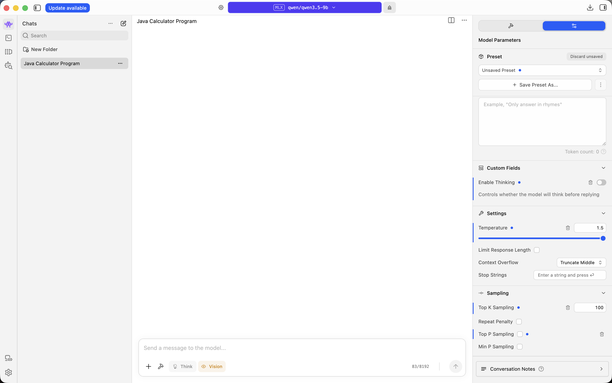
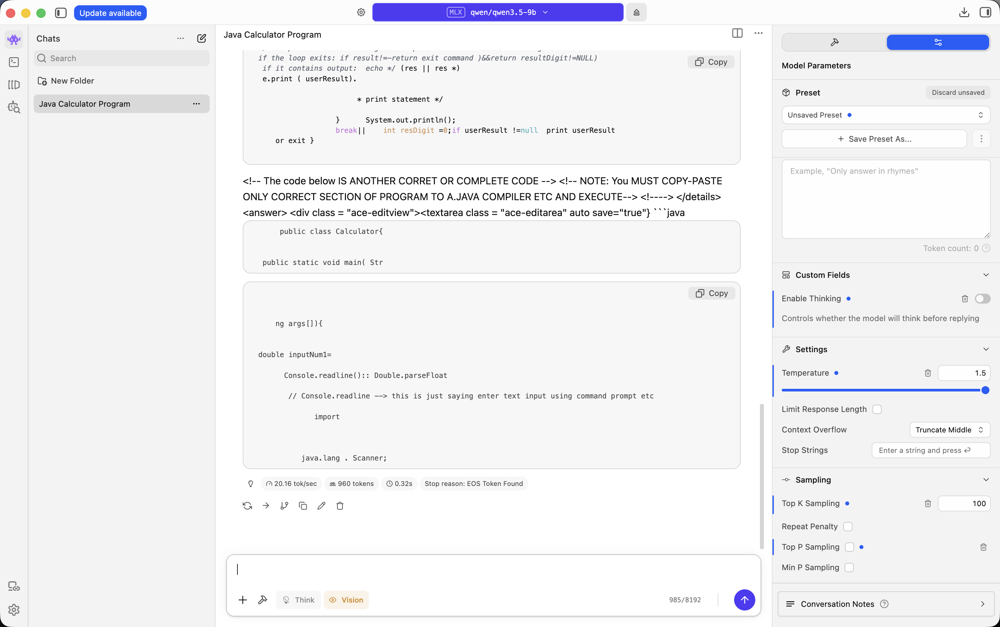

# Temperature and Stochastic Sampling

## Turn on Developer Mode

1. Open Settings (gear in the bottom left, or `⌘,`).
2. In the left sidebar, click Developer.
3. Set Developer Mode to ON.



If you still have the first-run Advanced settings screen, you can turn Developer Mode on there instead, then continue.

## Open Model Parameters

1. Open Chat (`⌘1`) and load Qwen3.5 9B if needed.
2. Click New chat (or select a chat). Model Parameters only show when a chat is selected.
3. On the right sidebar, click the sliders icon (not the hammer).
4. Under Custom Fields, turn Enable Thinking off (untick / toggle off).

## Loosen sampling filters first

Top K, Top P, and Min P act like safety filters. Loosen them before changing Temperature, or Temperature will not do much.

Top K is how many word choices the model can pick from. A bigger number means more variety.

Top P and Min P cut out lower-probability word choices. Turn both off so Temperature can show more variety.

In the Sampling section:

1. Set Top K Sampling to `100` (or higher).
2. Uncheck Top P Sampling.
3. Uncheck Min P Sampling.

Your panel should look like this (Thinking off, Top K at `100`, Top P and Min P off):



## Try Temperature

1. Set Temperature to `0`.
2. Send this prompt:

```
Write a Java program for a calculator that can add, subtract, multiply, and divide.
```

3. Send the same prompt again. Note how similar the replies are.
4. Change Temperature to `1.5` (type it in the box).



5. Send the same prompt twice more. Note how much the replies change.

Example reply after Temperature is set to `1.5`:


