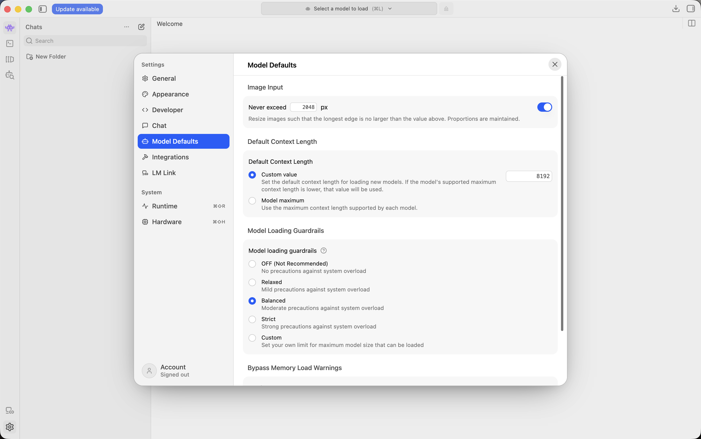
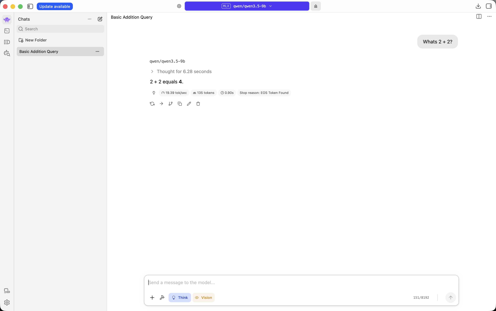

# Tokens and Context

## What tokens are

Models do not read text as whole words. They split it into tokens, which are small chunks (parts of words, whole words, or punctuation).

Roughly, 1 token ≈ ¾ of a word in English, but it varies. Code and unusual spellings often use more tokens.

Context length is the token budget for one chat turn: your system prompt + prior messages + new prompt + the model’s reply, up to a max. When you hit the limit, older messages get dropped or generation stops.

## Why it matters

- Locally: longer context uses more memory and can slow replies.
- Cloud APIs: you usually pay per token.

## Try it in LM Studio

1. Open Chat (`⌘1`) and load Qwen3.5 9B.
2. Open Settings (`⌘,`) → Model Defaults. Note Default Context Length (e.g. `8192`), the token budget for chats.



3. Start a New chat.
4. Send a short prompt:

```
What is 2 + 2?
```

5. Look near the chat input / status for token usage (often shown like `Token: current/total` or similar). Note how small it is.



6. Send a longer prompt (paste a short paragraph, or ask for a detailed explanation):

```
In 5 to 6 sentences, explain what a computer program is, what source code is, and how a program runs on a computer.
```

7. Compare token use to the short prompt. Longer text → more tokens.

## Takeaway

Tokens are the model’s unit of text. Context length is the budget. Keep chats focused when you care about speed or limits.
