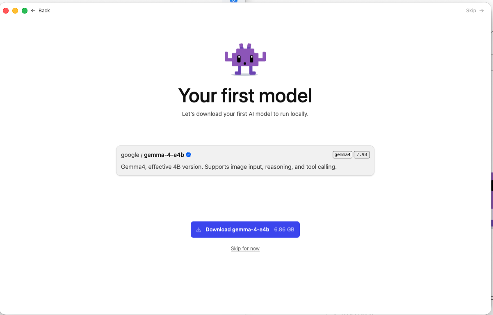
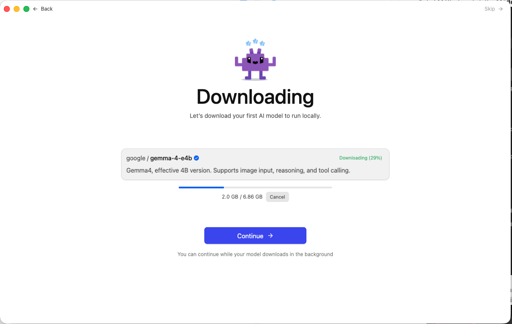
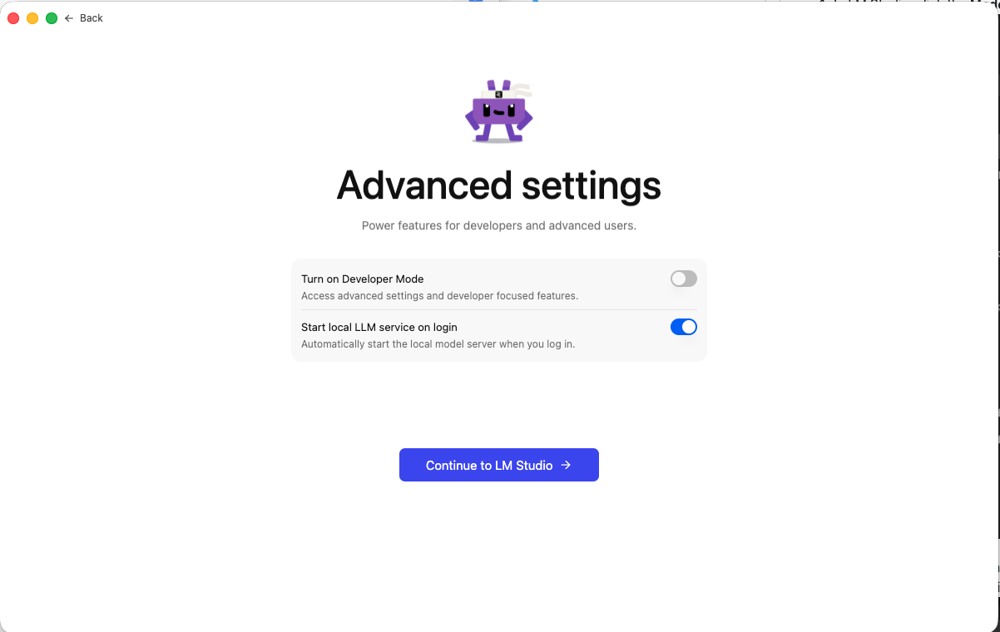
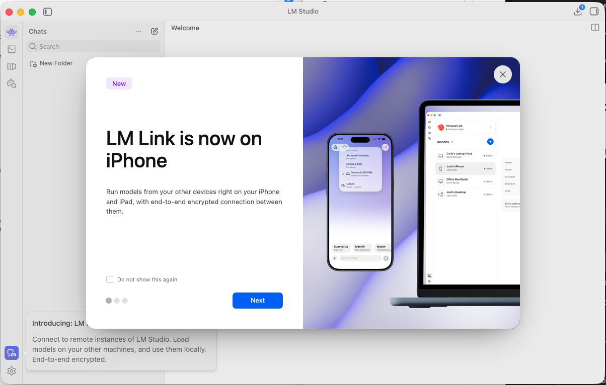
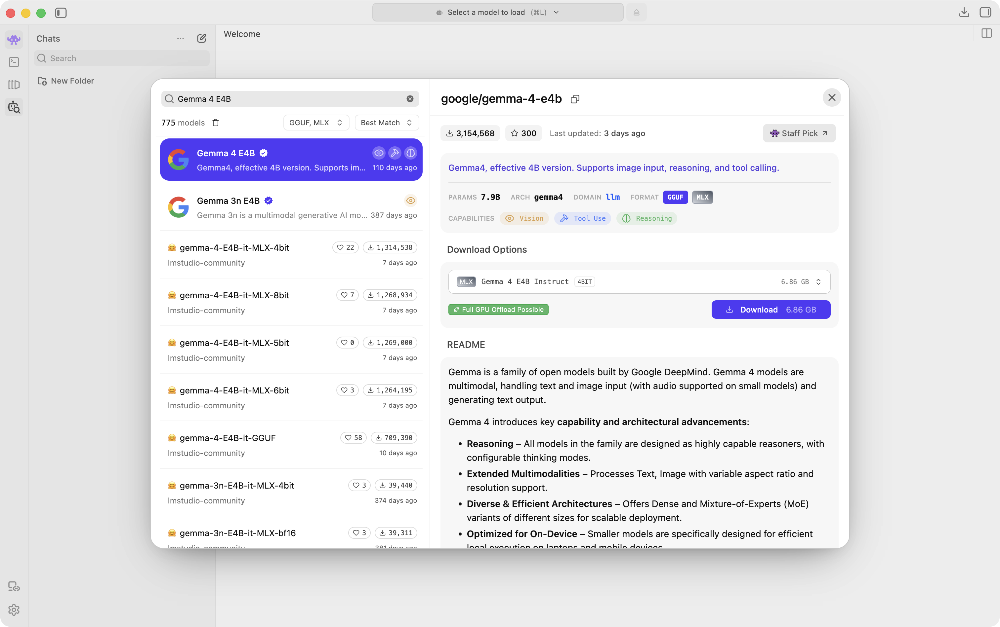
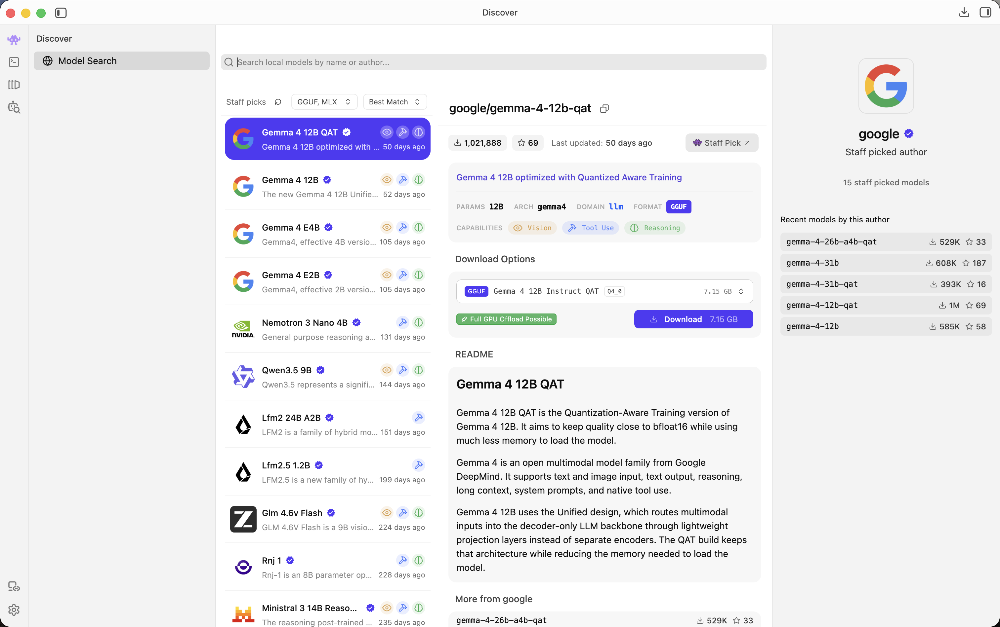
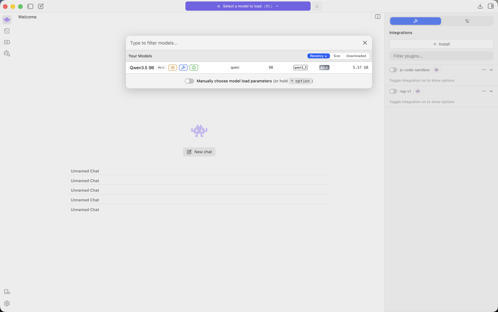

# Setup LM Studio

> **Note:** Do **not** install **Bionic** from the [lmstudio.ai](https://lmstudio.ai/) homepage — that is a different app. For this course, use **LM Studio** from [lmstudio.ai/download](https://lmstudio.ai/download).

## Download and Install

1. Open [lmstudio.ai/download](https://lmstudio.ai/download).
2. Click **Download** for your OS (e.g. **Download for Mac**).
3. Open the installer / app and launch **LM Studio**.

## First Launch Setup

The first time you open LM Studio, you will see a few setup screens.

### Your first model

One screen offers a default model — recently **`gemma-4-e4b`** (~**6.86 GB**). You do **not** need it for this course.

- **Skip for now** (or **Skip →**) to continue without it, or
- **Download gemma-4-e4b** if you want it later (it appears under **My Models**).

If you download it, you can keep going while it finishes in the background:

Later we will download the course model, **Qwen3.5 9B**.

### Advanced settings

You may see an **Advanced settings** screen:

For this course:

- Leave **Developer Mode** **off**.
- **Start local LLM service on login** can stay **on**, or turn it **off** to save background resources.

Then click **Continue to LM Studio →**.

### Promo screens

You may see feature promos (e.g. **LM Link**). These are optional — check **Do not show this again**, click **Next**, or close with **X**.

## Download a Model

1. Open **Discover → Model Search** (or press `⌘⇧M`).

2. Search for `Qwen3.5 9B`.
3. Select the official **Qwen3.5 9B** result.
4. Click **Download** (~5.98 GB; usually about **5 minutes**).

If it is already downloaded, you may see **Use in New Chat** instead.

## Load the Model and Chat

1. Click the **Chat** icon (or press `⌘1`).
2. Open **Select a model to load** at the top (or press `⌘L`).

3. Choose **`Qwen3.5 9B`** and wait for it to load.
4. Type a prompt and press **Enter**.
