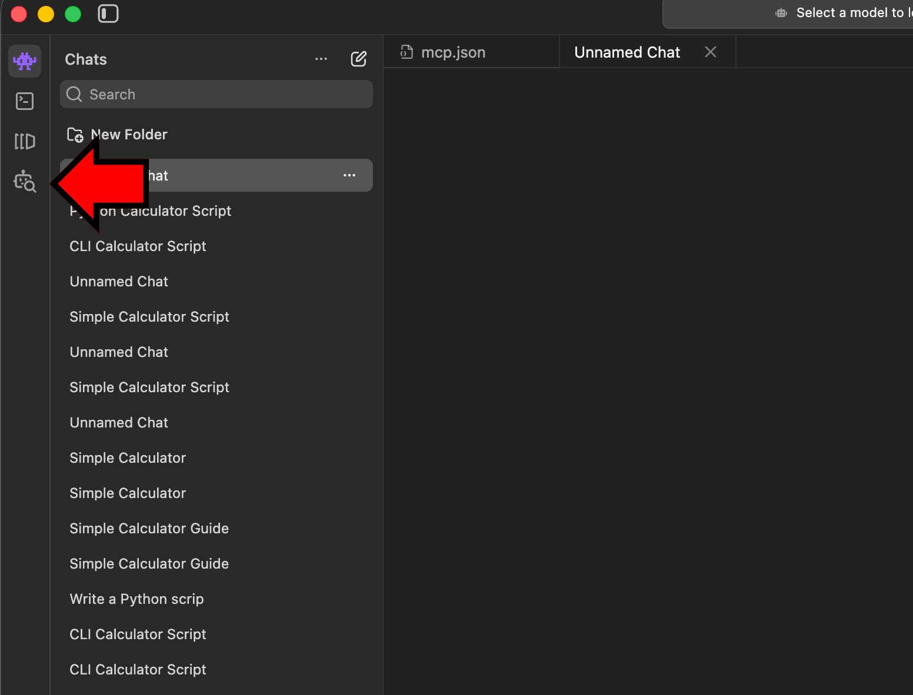
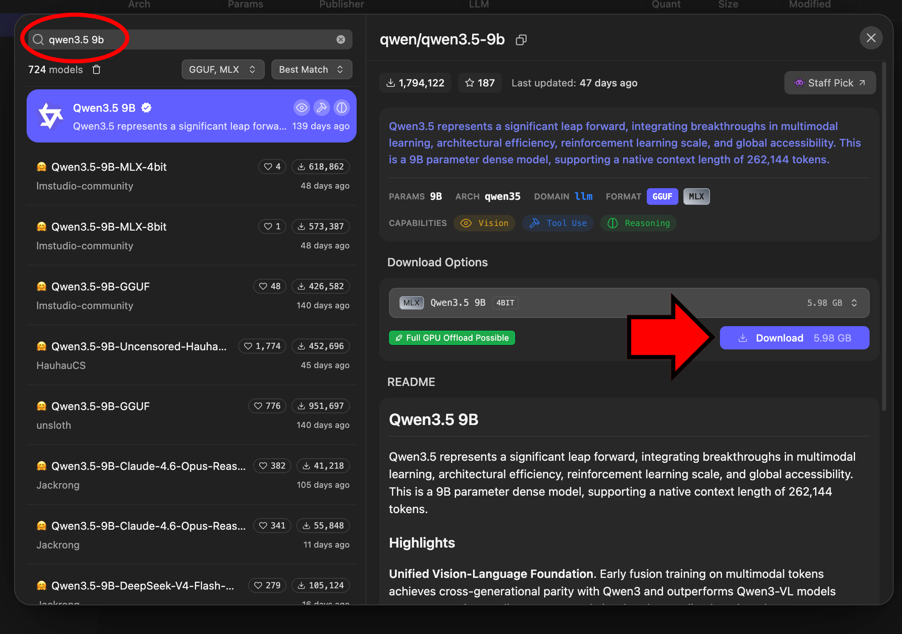
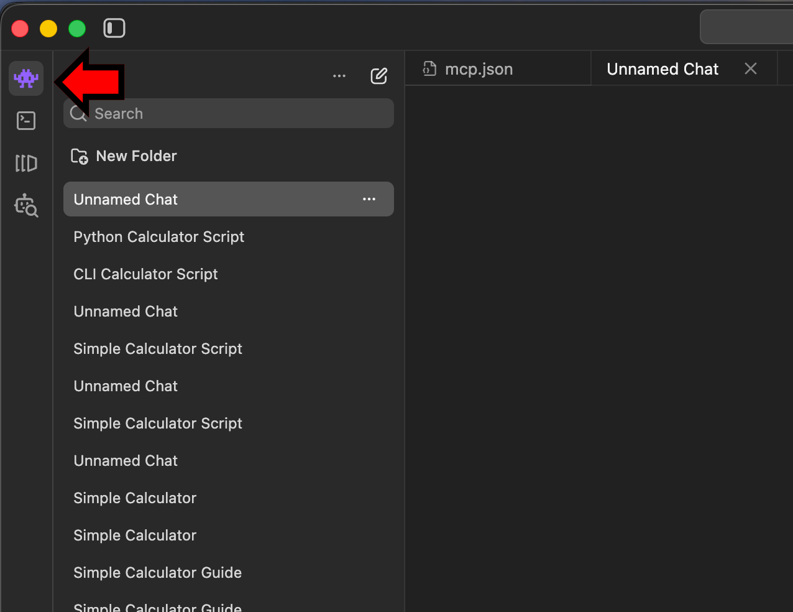

# Setup `LM Studio`

We will use the `lmstudio` application to host and run language models locally on your Mac. The application is not part of default macOS, so install it directly from the official site:

## 1. Download and Install
1. Navigate to [lmstudio.ai](https://lmstudio.ai/) in your web browser.
2. Click the **Download** button for your operating system (e.g., Download for Mac).

## 2. Download a Model
1. In LM Studio, click the **Model Search** icon (robot with magnifying glass) on the left sidebar or press `⌘⇧M`.

2. Use the search bar to find a model. Search for `Qwen3.5 9B` and click the **Download** button next and wait for the progress bar to finish. Alteritivly vist [Qwen3.5 9B on LMStudio](https://lmstudio.ai/models/qwen/qwen3.5-9b) to find the model.

## 3. Load the Model and Chat
**After Download is Complete** 
1. Click the **Chat** icon (Pixel Alien) on the left sidebar or press `⌘1`.

2. At the top center of the screen, click the drop-down menu that says "Select a model to load." or press `⌘L`.
3. Choose the model you just downloaded. Wait a moment for it to load into your system's memory.
4. Once loaded, type your first prompt into the chat box at the bottom and press **Enter** to start generating text locally!