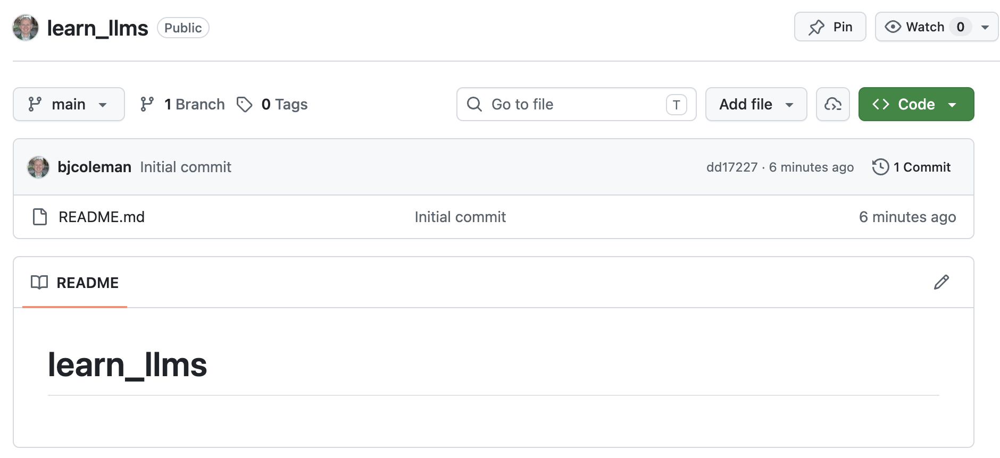

# Big Title

## Section Title


### Sub-section Title

When you type text, spacing doesn't        really matter.


Except double return, which is a paragraph.  I tend to use double blank line because some Markdown interpreters don't work without it.

You can make text **bold** or *italics*.


If you want to have a named variable like `foo` put it with backticks.


For a large code block, surround it with triple backticks:


```
def hello():
    print('hello world!')
```


Make sure to use double blank line before/after code blocks.

Also use double blank line before a new section.    


* bullet 1
* bullet 2


1. Item 1
2. Item 2


[Moravian University](https://www.moravian.edu/)





## Reference

